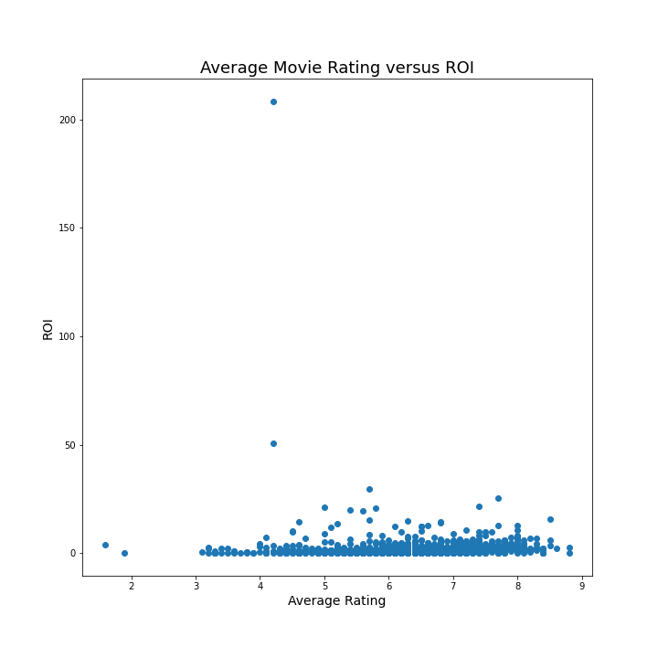
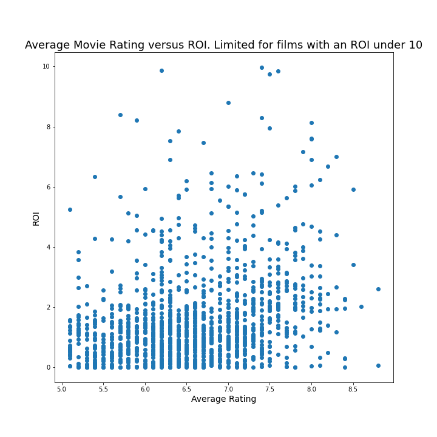
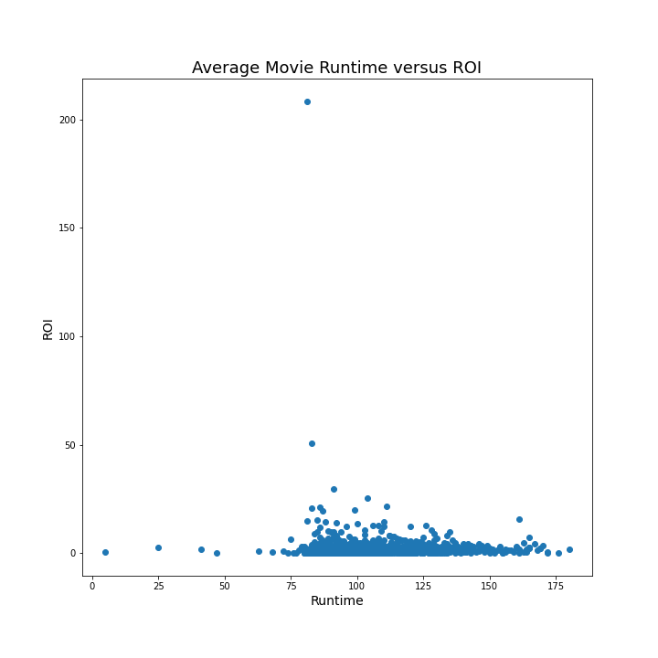
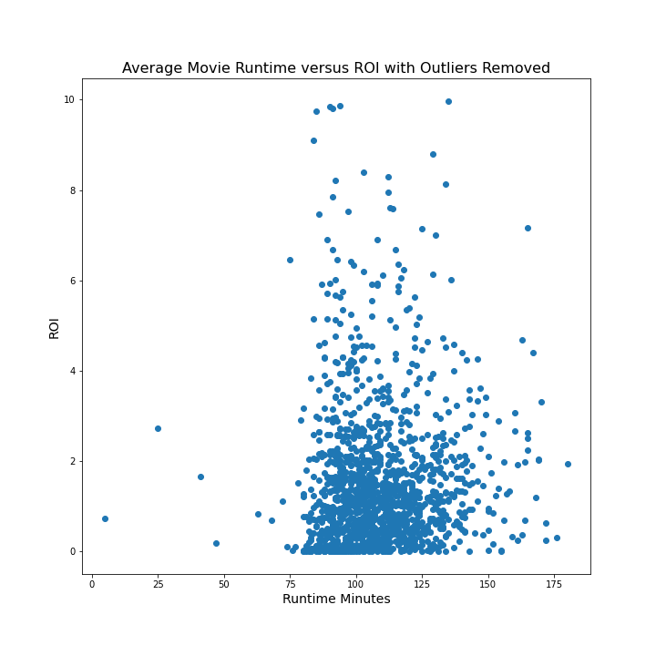
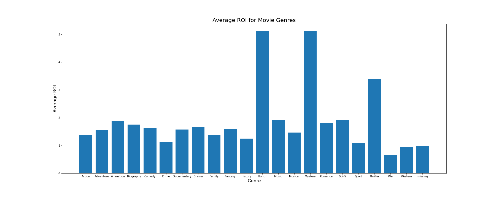
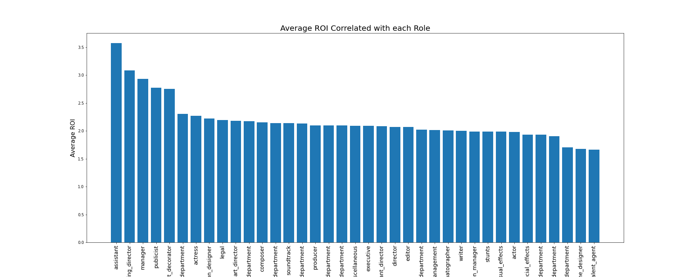

## Instructions for Navigation

This repository contains:
* A [jupyter notebook with](student.ipynb) the data analysis
* A [PDF](Phase_1_Final_project.pdf) of the presentation for the business stakeholders.
* The data [sources](zippedData) located in a folder called zipped data.

# Overview

In this repository, we will analyze movie data from several sources and draw conclusions on what variables impact movie success.

### Business Understanding

Microsoft sees all the big companies creating original video content and they want to get in on the fun. They have decided to create a new movie studio, but they don’t know anything about creating movies. We are tasked with exploring what types of films are currently doing the best at the box office, and translating these findings into actionable insights that the head of Microsoft's new movie studio can use to help decide what type of films to create.

### Data Understanding and Analysis

In the folder `zippedData` are movie datasets from:

* [IMDB](https://www.imdb.com/)
** This data source was used to pull data on the movie ratings, runtime, genres, and key roles and people associated with each movie. This data is stored in a SQLite database.
* [The Numbers](https://www.the-numbers.com/)
** This data source was used to pull data used to calculate the ROI such as production budget, domestic gross, and world wide gross. The data was stored as a CSV.

The data from these sources were joined to determine the effects of the following variables on a movie's return-on-investment.

#### Ratings
There was no correlation between ratings and ROI.

When removing the outliers, only a weak correlation was found.

#### Runtime

There was no correlation between runtime and ROI even after removing outliers.

No correlation after removing outliers.

#### Genres
The ROI of different movies was group by the different genres of movies and aggregated by the mean. Through this analysis, we determined that Horror, Mysteries, and thrillers have the highest ROI of the genres.

#### Roles

Next we grouped the ROI by the different roles in a movie production  aggregated by the mean. Through this analysis, we determined that the assistant, casting manager, and manager are associated with the highest ROI on average.

#### Conclusion

Several conclusions can be drawn from this analysis. Here are a few points

* Initially, Microsoft should invest in the horror, thriller, and mystery genres as they have the highest ROI on average.
* Since there is no correlation between movie runtime and ROI, Microsoft may not want to producer longer and more expensive movies.
* Since there is no correlation or a weak correlation between movie ratings and ROI, Microsoft does not need to invest time and energy investing in pleasing the critics.
* Microsoft should focus on hiring quality assistants, casting directors, and managers since these roles seem to be correlated with higher ROIs.
